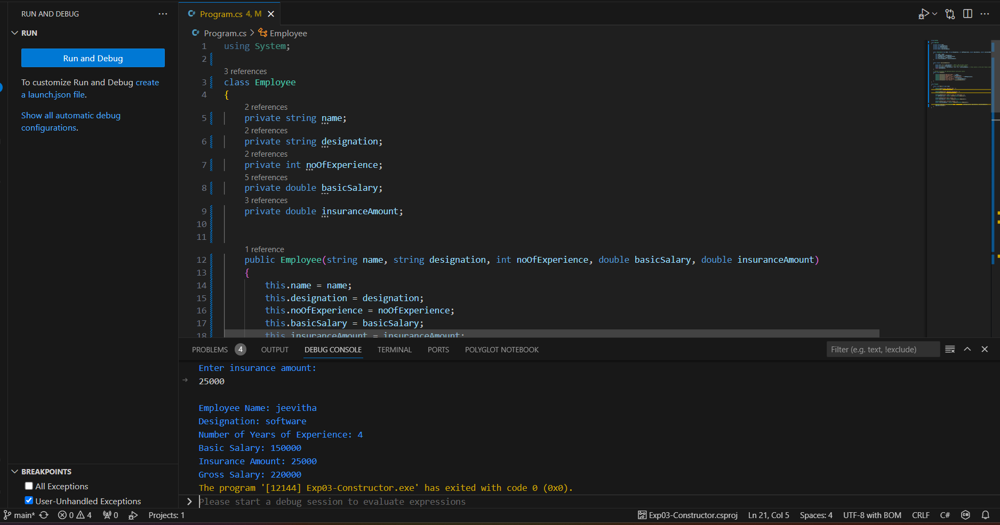
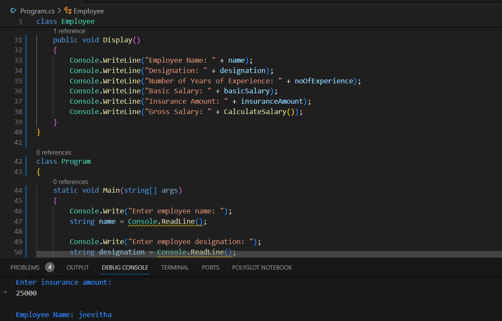

# Exp03-Constructor
## Aim: 
To write a C# program to calculate the salary of an employee by passing the name, designation, noofexperience, basic salary and insurance amount through constructor.

## Algorithm:
### Step1:
Initialize the program with the system library
### Step2:
Define the Employee Class and set it as public
### Step3:
Define the variables
### Step4:
Write a parameterized constructor under the class Employee
### Step5:
Define a function to calculate the salary
### Step6:
Define the display() function to print the output
## Program:
```
using System;

class Employee
{
    private string name;
    private string designation;
    private int noOfExperience;
    private double basicSalary;
    private double insuranceAmount;

    
    public Employee(string name, string designation, int noOfExperience, double basicSalary, double insuranceAmount)
    {
        this.name = name;
        this.designation = designation;
        this.noOfExperience = noOfExperience;
        this.basicSalary = basicSalary;
        this.insuranceAmount = insuranceAmount;
    }

    
    public double CalculateSalary()
    {
        double hra = 0.2 * basicSalary; // HRA is 20% of basic salary
        double ta = 0.1 * basicSalary; // TA is 10% of basic salary
        double grossSalary = basicSalary + hra + ta + insuranceAmount; // Gross salary is the sum of basic salary, HRA, TA and insurance amount
        return grossSalary;
    }

    // Method to display the employee details with gross salary
    public void Display()
    {
        Console.WriteLine("Employee Name: " + name);
        Console.WriteLine("Designation: " + designation);
        Console.WriteLine("Number of Years of Experience: " + noOfExperience);
        Console.WriteLine("Basic Salary: " + basicSalary);
        Console.WriteLine("Insurance Amount: " + insuranceAmount);
        Console.WriteLine("Gross Salary: " + CalculateSalary());
    }
}

class Program
{
    static void Main(string[] args)
    {
        Console.Write("Enter employee name: ");
        string name = Console.ReadLine();

        Console.Write("Enter employee designation: ");
        string designation = Console.ReadLine();

        Console.Write("Enter number of years of experience: ");
        int noOfExperience = Convert.ToInt32(Console.ReadLine());

        Console.Write("Enter basic salary: ");
        double basicSalary = Convert.ToDouble(Console.ReadLine());

        Console.Write("Enter insurance amount: ");
        double insuranceAmount = Convert.ToDouble(Console.ReadLine());

        Employee employee = new Employee(name, designation, noOfExperience, basicSalary, insuranceAmount);
        employee.Display();
    }
}
```

## Output:


## Result:
Thus, a C# program is written to calculate the salary of an employee using a constructor is implemented and the output is verified.